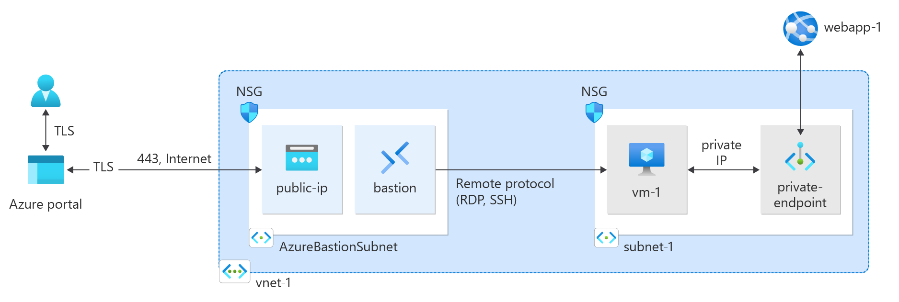

# Azure Web App private endpoint integration 

Aim: deploy an Azure Web App that's securely connected to via private endpoint 

### Architecture 

### Connection flow:

1. **User Access via Azure Portal**
  - User connects to the Azure portal over TLS (HTTPS).
2. **Accessing Azure Bastion**
  - From the portal, user connects to Azure Bastion.
  - Bastion provides secure RDP/SSH to the VM without exposing the VM's public IP.
3. **VM Connection**
  - Azure Bastion connects to VM (vm-1) over the internal network using RDP/SSH.
  - VM is in subnet-1 within vnet-1.
4. **Private Endpoint Connection**
  - VM (vm-1) communicates with web app (webapp-1) via a private endpoint.
  - Traffic remains within the Azure network, using private IPs.

### Deployment

1. **Create `terraform.tfvars` in `az-infra`**
   - Set `vm_admin` and `vm_pwd` for Azure Bastion connection.
2. **Update `tfm-prereq.ps1`**
   - Change `$storageAccountName` to something unique.
   - Ensure `main.tf`'s `azurerm` backend references your storage account.
3. **Authenticate to Azure**
   - `az login`
   - Set subscription: `az account set --subscription <your subscription ID>`.
4. **Deploy Storage Account for Terraform Backend**
   - Run: `.\tfm-prereq.ps1`.
5. **Deploy Terraform Infrastructure**
   - `terraform init`
   - `terraform validate`
   - `terraform plan`
   - `terraform apply --auto-approve`
   - (Validation and plan review are optional).
6. **Log into Test VM**
   - Use Azure Bastion with `terraform.tfvars` credentials.
7. **Check Web App's Nameserver** 
   - Use: `nslookup <app service hostname>`.
   - Reference terraform outputs for command to run. 
8. **Test Web App Access**
   - From the test VM, access the web app URL in a browser.
   - Verify access denial from your own browser to confirm private endpoint configuration.

### Clearning resources

1. **Delete Infrastructure via Terraform**
  - Within `az-infra`: `terraform destroy --auto-approve`.
2. **Delete Resource Group in Azure Portal**
  - Remove `tfmstaterg`, which contains the storage account used for state data.

### Documentation

* [Working with NSG access and Azure Bastion](https://learn.microsoft.com/en-us/azure/bastion/bastion-nsg)
* [What is a private endpoint?](https://learn.microsoft.com/en-us/azure/private-link/private-endpoint-overview)